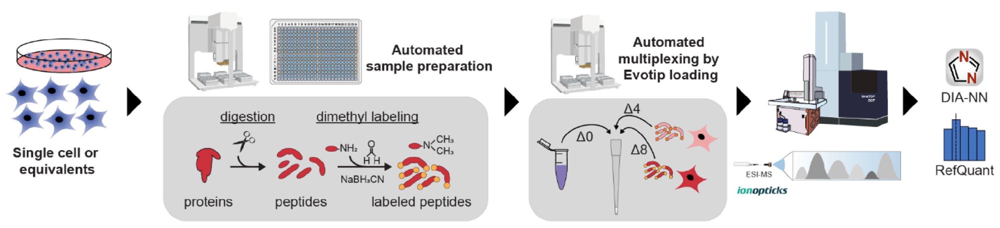
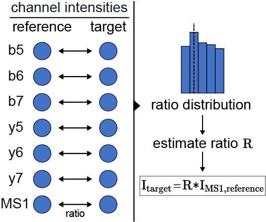

<!-- 

[](https://pepy.tech/project/refquant)
[](https://pepy.tech/project/refquant)
[](https://pepy.tech/project/refquant) -->


# RefQuant
An open-source Python package of the AlphaPept ecosystem from the [Mann Labs at the Max Planck Institute of Biochemistry](https://www.biochem.mpg.de/mann) and the [University of Copenhagen](https://www.cpr.ku.dk/research/proteomics/mann/). To enable all hyperlinks in this document, please view it at [GitHub](https://github.com/MannLabs/refquant).

- [RefQuant](#refquant)
  - [About](#about)
  - [License](#license)
  - [Installation](#installation)
  - [Usage](#usage)
  - [Troubleshooting](#troubleshooting)
  - [Citations](#citations)
  - [How to contribute](#how-to-contribute)
  - [Changelog](#changelog)

---
## About

RefQuant is an algorithm for **Ref**erence-based **Quant**ification in multiplexed single cell/low input proteomics, applicable to proteomics data acquired with multiplexed data-independent acquisition (mDIA) using a reference channel, as described by [Thielert et al.](https://www.biorxiv.org/content/10.1101/2022.12.02.518917v1.article-info) and visualized in fig. 1 below. RefQuant currently takes [DIA-NN](https://github.com/vdemichev/DiaNN) processed mDIA files as input and generates an output table containing precursor intensities. For the analysis, RefQuant relies on a stable, higher-abundance reference channel that has been measured together with every single cell sample. The precursor quantities are derived by estimating the ratio to the reference channel based on the MS1 as well as the fragment information (see paper for details).

<figure><figcaption><em>Figure1: mDIA single cell workflow. See manuscript for a detailed description.</em></figcaption></figure>
<figure><figcaption><em>Figure 2: Summary of the RefQuant principle. See manuscript for a detailed description.</em></figcaption></figure>

---
## License

RefQuant was developed by the [Mann Labs at the Max Planck Institute of Biochemistry](https://www.biochem.mpg.de/mann) and the [University of Copenhagen](https://www.cpr.ku.dk/research/proteomics/mann/) and is freely available with an [Apache License](LICENSE.txt). External Python packages (available in the [requirements](requirements) folder) have their own licenses, which can be consulted on their respective websites.

---
## Installation

RefQuant can be installed in editable (i.e. developer) mode with a few `bash` commands. This allows to fully customize the software and even modify the source code to your specific needs. When an editable Python package is installed, its source code is stored in a transparent location of your choice. While optional, it is advised to first (create and) navigate to e.g. a general software folder:

```bash
mkdir ~/folder/where/to/install/software
cd ~/folder/where/to/install/software
```

***The following commands assume you do not perform any additional `cd` commands anymore***.

Next, download the RefQuant repository from GitHub either directly or with a `git` command. This creates a new RefQuant subfolder in your current directory.

```bash
git clone https://github.com/MannLabs/refquant.git
```

For any Python package, it is highly recommended to use a separate [conda virtual environment](https://docs.conda.io/en/latest/), as otherwise *dependancy conflicts can occur with already existing packages*.

```bash
conda create --name refquant python=3.8 -y
conda activate refquant
```

Finally, RefQuant and all its [dependancies](requirements) need to be installed. To take advantage of all features and allow development (with the `-e` flag), this is best done by also installing the [development dependencies](requirements/requirements_development.txt) instead of only the [core dependencies](requirements/requirements.txt):

```bash
pip install -e "./refquant[development]"
```

By default this installs loose dependancies (no explicit versioning), although it is also possible to use stable dependencies (e.g. `pip install -e "./refquant[stable,development-stable]"`).

***By using the editable flag `-e`, all modifications to the [refquant source code folder](refquant) are directly reflected when running RefQuant. Note that the RefQuant folder cannot be moved and/or renamed if an editable version is installed. In case of confusion, you can always retrieve the location of any Python module with e.g. the command `import module` followed by `module.__file__`.***

---
## Usage

RefQuant can be imported as a Python package into any Python script or notebook with the command `import refquant`.

A brief [Jupyter notebook tutorial](nbs/tutorial.ipynb) on how to use the API is also present in the [nbs folder](nbs).

---
## Troubleshooting

In case of issues, check out the following:

* [Issues](https://github.com/MannLabs/refquant/issues): Try a few different search terms to find out if a similar problem has been encountered before
* [Discussions](https://github.com/MannLabs/refquant/discussions): Check if your problem or feature requests has been discussed before.

---
## Citations

Thielert, Marvin, et al. "Robust dimethyl-based multiplex-DIA workflow doubles single-cell proteome depth via a reference channel." bioRxiv (2022).
([bioRxiv](https://www.biorxiv.org/content/10.1101/2022.12.02.518917v1.article-info))

---
## How to contribute

If you like this software, you can give us a [star](https://github.com/MannLabs/refquant/stargazers) to boost our visibility! All direct contributions are also welcome. Feel free to post a new [issue](https://github.com/MannLabs/refquant/issues) or clone the repository and create a [pull request](https://github.com/MannLabs/refquant/pulls) with a new branch. For an even more interactive participation, check out the [discussions](https://github.com/MannLabs/refquant/discussions) and the [the Contributors License Agreement](misc/CLA.md).

---
## Changelog

See the [HISTORY.md](HISTORY.md) for a full overview of the changes made in each version.
